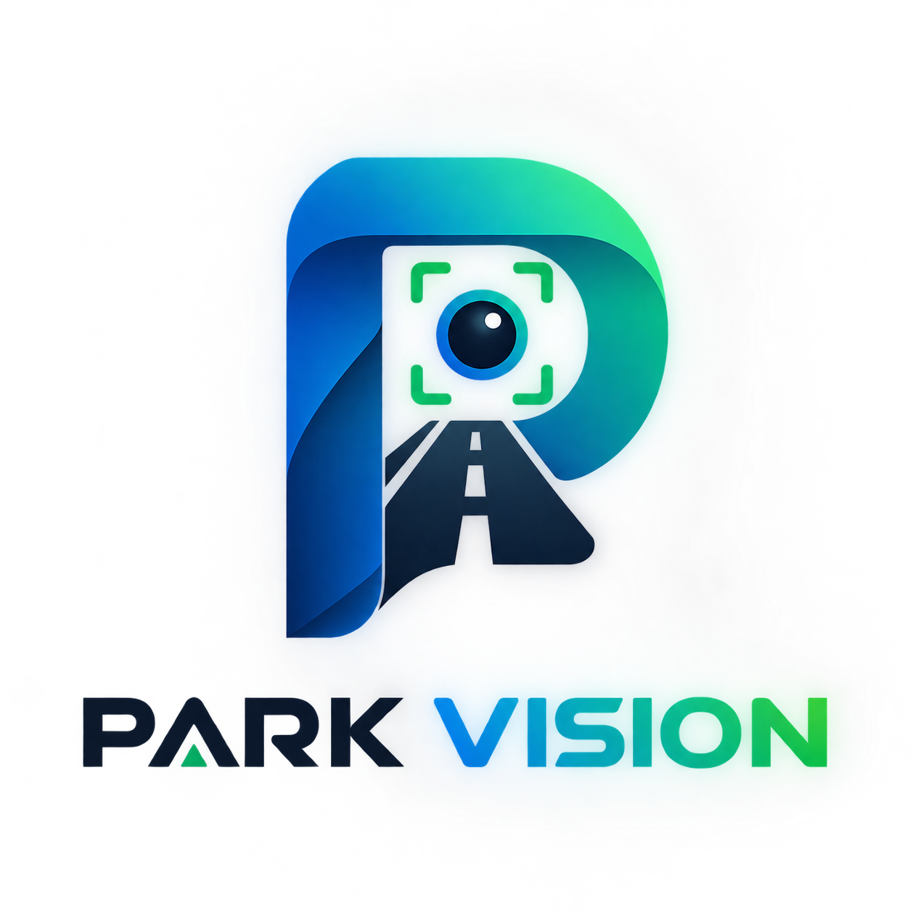
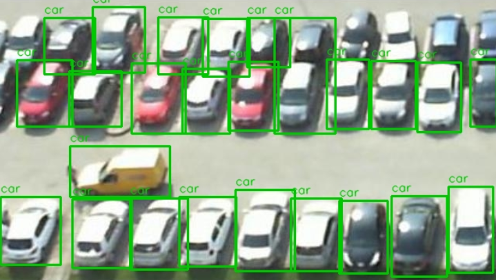

<p align="center">
  
</p>


# Park-Vision — Smart On-Street Parking Detection


A system that analyzes fixed street-camera footage to automatically detect
whether roadside parking spots are occupied or empty. Unlike most similar
projects, which target overhead parking lots with fixed painted stalls, this
system is built for **on-street parking** (camera at an oblique angle, no
pre-marked stalls) and uses a **Gap Detection** algorithm to measure the
real-world distance (in meters) between consecutive parked vehicles.
Minimal skeleton: take or pick a photo, send it to the Park-Vision backend's
`/detect-pixel` endpoint (no camera calibration needed), and see detected
vehicles (red boxes) and candidate empty parking spots (green boxes) drawn
directly on the photo.

## Architecture

```
Camera image / video
        │
        ▼
YOLOv8 (vehicle detection)
        │
        ▼
SORT (multi-frame vehicle tracking, video only)
        │
        ▼
Perspective transform (pixels → real-world meters, per-camera calibration)
        │
        ▼
Gap Detection (distance between vehicles → empty/occupied spot)
        │
        ▼
FastAPI (POST /detect, POST /calibrate, GET /status)
        │
        ├──▶ Streamlit dashboard (live view)
        └──▶ Click-based calibration tool
```

## Project structure

```
Park-Vision/
├── app/
│   ├── main.py             FastAPI application
│   ├── routes.py           Three endpoints: /detect, /calibrate, /status
│   ├── schemas.py          Pydantic models
│   ├── calibration.py      Save/load per-camera homography
│   ├── perspective.py      Pixel-to-real-world coordinate transform
│   ├── vehicle_detector.py YOLOv8 wrapper
│   ├── tracker.py          SORT algorithm for video vehicle tracking
│   ├── gap_detector.py     Core Gap Detection algorithm
│   └── visualization.py    Drawing helpers for the dashboard
├── streamlit_app.py         Live dashboard (image/video)
├── calibrate_tool.py         Click-based calibration point picker
├── process_video.py          CLI for offline processing of a recorded video
├── dataset_tools/             Dataset preparation and fine-tuning tools
│   ├── extract_frames.py
│   ├── organize_dataset.py
│   ├── dataset_stats.py
│   ├── train.py
│   ├── evaluate.py
│   └── prepare_external_dataset.py
├── colab/                      Google Colab notebook for fine-tuning
│   └── park_vision_roadside_parking_finetune.ipynb
├── tests/                     35 pytest tests covering the modules above
├── requirements.txt
├── requirements-dev.txt
├── Dockerfile
└── docker-compose.yml
```

## Setup and usage (without Docker)

```bash
pip install -r requirements.txt
```

**1. Calibrate a camera** (once per camera, before anything else):

```bash
streamlit run calibrate_tool.py
runs/street_parking/weights/best.pt
```
Upload a reference image from the camera, click 4 points and enter their
real-world coordinates in meters, check the bird's-eye preview, and save.

**2. Run the API:**
## Setup

```bash
uvicorn app.main:app --reload
npm install
```
Interactive docs: `http://localhost:8000/docs`

> The first time the server starts, loading PyTorch/YOLO can take about
> 60 seconds — this is expected.
## Point it at your backend

**3. Live dashboard:**
Edit `src/api/parkVision.ts`:

```bash
streamlit run streamlit_app.py
```ts
export const API_BASE_URL = 'http://localhost:8000';
```

**4. Offline processing of a recorded video:**
- **Physical phone (Expo Go)**: use your computer's LAN IP, e.g.
  `http://192.168.1.20:8000` (phone and computer must be on the same Wi-Fi).
- **Android emulator**: `http://10.0.2.2:8000` (special alias to the host machine).
- **iOS simulator**: `http://localhost:8000` works as-is.
- **CORS**: the FastAPI backend needs CORS enabled to accept requests from
  the app — this hasn't been added yet on the backend side (next step).

```bash
python process_video.py street_footage.mp4 street-01 results.jsonl
```

## Running with Docker
## Run

```bash
docker compose up --build
npx expo start
```

This starts three services:

| Service | Address | Description |
|---|---|---|
| `api` | `http://localhost:8000` | FastAPI |
| `dashboard` | `http://localhost:8501` | Live dashboard |
| `calibrate` | `http://localhost:8502` | Calibration tool |
Scan the QR code with Expo Go (Android/iOS), or press `a` / `i` for an
emulator/simulator, or `w` to run in a browser.

All three services share a `calibrations` volume, so a calibration saved
from the `calibrate` service is immediately available to `api` and
`dashboard` as well.

## Dataset preparation and fine-tuning

Full details in [`dataset_tools/README.md`](dataset_tools/README.md).
Summary workflow:
## Project structure

```bash
python dataset_tools/extract_frames.py video.mp4 raw_frames/ --street azadi --lighting day
# label with LabelImg or Roboflow
python dataset_tools/dataset_stats.py raw_frames/
python dataset_tools/organize_dataset.py raw_frames/ raw_labels/ dataset/
python dataset_tools/train.py dataset/data.yaml
python dataset_tools/evaluate.py runs/detect/street_parking/weights/best.pt dataset/data.yaml
```

No street footage yet? [`colab/park_vision_roadside_parking_finetune.ipynb`](colab/park_vision_roadside_parking_finetune.ipynb)
downloads a public street-level dataset from Roboflow and runs the whole
pipeline end to end on Google Colab.

<p align="center">
  
</p>

## Tests

```bash
pip install -r requirements-dev.txt
pytest tests/ -v
App.tsx
src/
  api/parkVision.ts       API client + TypeScript types matching the backend schema
  components/
    DetectionOverlay.tsx   Draws red/green boxes on the photo using react-native-svg
  screens/
    HomeScreen.tsx          Take/pick photo, call the API, show results + counts
```

35 tests, including unit tests for the Gap Detection algorithm, the SORT
tracker, calibration, and an integration test of the API via `TestClient`.

## Acceptance criteria (from the feasibility document)

| Criterion | Threshold | Measured by |
|---|---|---|
| Vehicle detection precision | ≥ 85% | `dataset_tools/evaluate.py` |
| Vehicle detection recall | ≥ 80% | `dataset_tools/evaluate.py` |
| mAP@0.5 | ≥ 80% | `dataset_tools/evaluate.py` |
| Per-frame processing time (CPU, no GPU) | < 3 seconds | `dataset_tools/evaluate.py` |
| Occupied/empty accuracy (daylight) | ≥ 90% | Requires field testing with real data |
| Occupied/empty accuracy (dusk/shade) | ≥ 80% | Requires field testing with real data |

## Current project status

The code and infrastructure (API, tracking, dashboard, calibration tool,
dataset tools, tests, Docker) are complete and tested. The remaining
steps — collecting real footage from Mashhad streets, fine-tuning on that
real data, and the final field test — are field work that the project team
needs to carry out.
this is my first official project. wish me luck!
## What's next

- Enable CORS on the FastAPI backend.
- Add a settings screen to configure `API_BASE_URL` and `camera_id` from within the app.
- Add a history screen backed by `GET /history/{camera_id}`.
this proejct is not done yet.